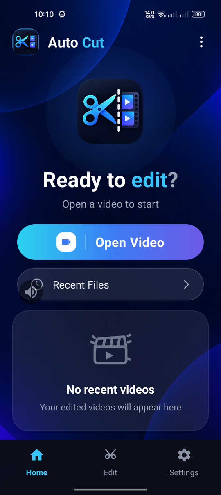

<div align="center">

# ✂️ Auto Cut

**A clean, one-screen Android launcher UI for your video editing workflow.**

*CapCut-inspired dark panel aesthetic · Built with native Android (Kotlin + XML)*

[](https://developer.android.com)
[-blue)](https://developer.android.com/about/versions/oreo)
[](https://kotlinlang.org)
[](https://gradle.org)
[](#license)

[Features](#-features) •
[Preview](#-preview) •
[Tech Stack](#-tech-stack) •
[Project Structure](#-project-structure) •
[Getting Started](#-getting-started) •
[Roadmap](#-roadmap)

</div>

---

## ✨ Features

| | Feature | Description |
|:-:|---|---|
| 🎨 | **CapCut-style dark theme** | Dark + white mixed panel palette (`#1B1B1D` → `#070B18`) with cyan/blue/purple accents |
| 🖼️ | **Full-bleed wallpaper** | `main_bg.webp` rendered edge-to-edge with `centerCrop` |
| 🧭 | **Single-screen navigation** | Header • Hero • Primary CTA • Recents • Empty state • Bottom nav — all in one page |
| 🌈 | **Gradient primary button** | Cyan → Blue → Violet pill with ripple feedback |
| 📭 | **Empty state card** | Clapperboard illustration + friendly copy, height-adaptive so nothing clips |
| 📱 | **Edge-to-edge aware** | Status/navigation bar insets handled programmatically, gesture pill safe |
| ♿ | **Accessible** | Content descriptions on every interactive/iconic view |
| 🌗 | **Always dark** | Forced night mode so the panel never flashes light |

## 📸 Preview

<div align="center">
  
  <br/>
  <sub>Home screen — <code>app/src/main/res/layout/activity_main.xml</code></sub>
</div>

## 🛠 Tech Stack

- **Language** — Kotlin 100%
- **UI** — XML layouts + `ConstraintLayout` / `LinearLayout`
- **Design System** — Material 3 (`Theme.Material3.DayNight.NoActionBar`)
- **Build** — Gradle Kotlin DSL (`build.gradle.kts`) + Version Catalog (`libs.versions.toml`)
- **Min SDK** 26 (Android 8.0) · **Target SDK** 37

## 📂 Project Structure

```
Auto Cut/
├── app/src/main/
│   ├── java/com/example/autocut/
│   │   └── MainActivity.kt          # Edge-to-edge insets + spannable title colors
│   ├── res/
│   │   ├── drawable/
│   │   │   ├── main_bg.webp         # Full-screen background wallpaper
│   │   │   ├── auto_cut.webp        # App logo (header + hero)
│   │   │   ├── bg_btn_primary.xml   # Cyan→Violet gradient pill
│   │   │   ├── bg_btn_secondary.xml # Outlined "Recent Files" pill
│   │   │   ├── bg_card.xml          # Empty-state card surface
│   │   │   ├── bg_glow.xml          # Radial glow behind hero icon
│   │   │   └── ic_*.xml             # Vector icon set (9 icons)
│   │   ├── layout/activity_main.xml # The single-page UI
│   │   ├── values/                  # colors · strings · themes
│   │   └── values-night/            # Dark theme variant
│   └── AndroidManifest.xml
├── gradle/libs.versions.toml        # Version catalog
└── build.gradle.kts
```

## 🚀 Getting Started

**Prerequisites:** Android Studio (Ladybug or newer), JDK 17+, Android device/emulator on API 26+.

```bash
# clone
git clone git@github.com:tanmoymondal1312/Open-Cut.git
cd Open-Cut

# build debug APK
./gradlew assembleDebug

# install on a connected device
adb install -r app/build/outputs/apk/debug/app-debug.apk
```

On Windows use `gradlew.bat` instead of `./gradlew`.

## 🗺 Roadmap

- [ ] Video picker integration on the primary CTA
- [ ] Recent files list backed by MediaStore
- [ ] Bottom navigation routing (Home / Edit / Settings)
- [ ] Splash + onboarding flow
- [ ] Play Store release build (signing + R8)

## 🤝 Contributing

Issues and pull requests are welcome. Please keep the single-screen layout philosophy and the existing color tokens intact.

## 📄 License

This project is licensed under the MIT License — see [LICENSE](#license) for details.

---

<div align="center">
  <sub>Built with ⚡ Kotlin · XML · Material 3</sub>
</div>
