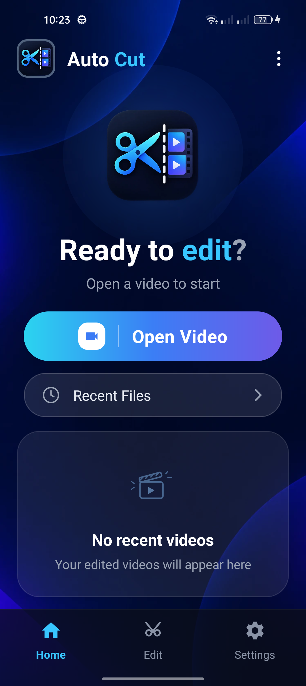
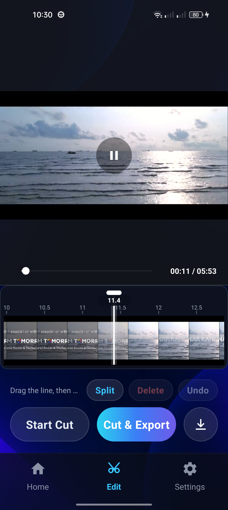
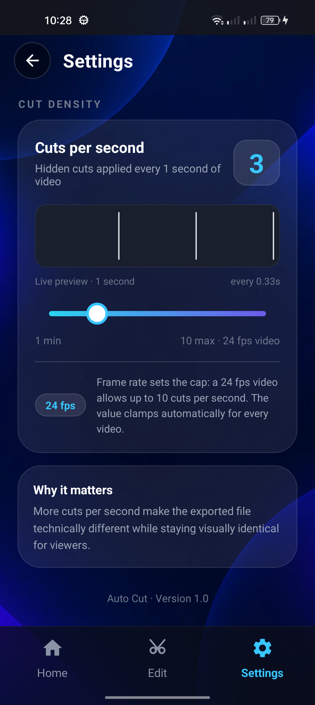

<div align="center">

# ✂️ Auto Cut

**Frame-accurate automatic video cutter for Android.**

Open a video → pick a cut rate → export. Auto Cut does the rest,
splitting the file at exact frame boundaries so the result plays back
smoothly with no stutter and no dropped frames.

[](https://www.android.com)
[-2256D8)](https://developer.android.com/about/versions/oreo)
[](https://kotlinlang.org)
[](https://ffmpeg.org)
[](LICENSE)

[](https://github.com/tanmoymondal1312/Open-Cut/raw/main/downloads/AutoCut-v1.0.apk)

[⬇️ Download](#-download) •
[✨ Features](#-features) •
[📸 Screenshots](#-screenshots) •
[⚙️ How it works](#%EF%B8%8F-how-it-works) •
[🛠 Building](#-building-from-source) •
[📄 License](#-license)

</div>

---

## ⬇️ Download

| | |
|:--|:--|
| **Latest release** | **[AutoCut-v1.0.apk](https://github.com/tanmoymondal1312/Open-Cut/raw/main/downloads/AutoCut-v1.0.apk)** |
| Version | 1.0 (`versionCode` 1) |
| Package | `com.mediaghor.autocut` |
| Size | ~82 MB (bundles the full FFmpeg engine) |
| Requires | **Android 8.0 (API 26)** or newer · arm64-v8a / armeabi-v7a |
| Signed | Release keystore — safe to install and to update over later |

### 📲 Install in 3 steps (no computer needed)

1. **Tap the APK link above** — the file downloads to your phone.
2. **Open the downloaded file.** If Android shows *"For your security, your phone is not allowed to install unknown apps from this source"* — tap **Settings**, turn on **Allow from this source**, then go back.
3. Tap **Install**, then open **Auto Cut**.

> The app only asks for access to your videos so it can list them in the picker.
> Nothing is uploaded anywhere — every cut and export happens on your device.

---

## 📸 Screenshots

<table>
  <tr>
    <td align="center" width="33%">
      <br/>
      <sub><b>Home</b> — open a video to start</sub>
    </td>
    <td align="center" width="33%">
      <br/>
      <sub><b>Editor</b> — preview, timeline, split &amp; delete</sub>
    </td>
    <td align="center" width="33%">
      <br/>
      <sub><b>Settings</b> — cut density control</sub>
    </td>
  </tr>
</table>

---

## 🎯 What is Auto Cut?

**Auto Cut** is a free, open-source Android video editing app that performs
**automatic, evenly spaced, frame-accurate cuts** on a video file.

Instead of scrubing through a timeline by hand, you choose a rate — say
**3 cuts per second** — and the engine walks the file and splits it at
every interval **on the exact frame boundary**. Because every split lands
on a frame boundary, the exported video plays back exactly like the
original: no black frames, no jitter, no audio drift.

The app is built entirely for **offline use**. The whole pipeline —
reading, cutting, and muxing — runs on the phone through a bundled
FFmpeg build and Android's hardware codecs. No server, no account, no
watermark, no export limits.

### Who is it for?

- Editors who need to **split long footage into segments automatically**
- Anyone who wants a **fast, one-tap batch cutter** on a phone
- Developers who want a **Kotlin + FFmpeg reference implementation** for
  on-device video processing, and want to fork it and customize it

---

## ✨ Features

| | Feature | Details |
|:-:|---|---|
| ⚡ | **Automatic multi-point cutting** | Choose a cut rate (1–10 cuts/sec) and the whole file is split in one pass |
| 🎯 | **Frame-accurate split points** | Cuts are quantised to the source frame interval — output stays visually identical |
| 🎚️ | **Cut density control** | Live preview strip shows exactly where cuts will land before you start |
| 🎞️ | **Frame-rate aware cap** | Max cuts/sec is derived from the video's fps (e.g. 24 fps → 10 max) and clamps automatically |
| 🧭 | **Manual timeline editor** | Draggable playhead, tap-to-position, **Split / Delete / Undo** on any range |
| 👀 | **Live preview panel** | Scrub the preview directly with your finger; the timeline follows playback |
| 🖼️ | **Filmstrip timeline** | Real frame thumbnails extracted with FFmpeg, loaded in the background |
| 🚀 | **Parallel cut engine** | Multi-worker FFmpeg pipeline with progress bar, per-cut counter and cancel |
| 🔍 | **Gallery picker** | Bottom-sheet picker with thumbnails, duration and file size |
| 💾 | **One-tap export** | Result is written straight to your `Download/` folder |
| 🌙 | **CapCut-style dark UI** | Always-dark Material 3 theme, edge-to-edge, gesture-bar safe |
| 📴 | **Fully offline** | No network permission, no analytics, no telemetry |

---

## ⚙️ How it works

```
┌──────────────┐   ┌──────────────────┐   ┌────────────────┐   ┌─────────────┐
│  Open Video  │ → │ Set cut density  │ → │   Start Cut    │ → │   Export    │
│  (picker)    │   │  (cuts / second) │   │ (parallel FFmpeg) │  │  Download/  │
└──────────────┘   └──────────────────┘   └────────────────┘   └─────────────┘
```

1. **Open Video** — pick a file from the built-in gallery sheet.
2. **Settings → Cuts per second** — the slider previews the spacing in real
   time; the fps chip shows the cap for the current file.
3. **Start Cut** — the engine probes the file, builds a frame index, then
   runs the splits across several workers and muxes the segments back together.
4. **Cut & Export** — the finished MP4 is saved to `Download/`.

You can stop anywhere — the timeline's **Split / Delete / Undo** lets you
carve the clip manually before or instead of an automatic pass.

### Requirements

| | Minimum | Recommended |
|---|:--:|:--:|
| Android | 8.0 (API 26) | 12+ (API 31+) |
| RAM | 3 GB | 4 GB+ |
| Storage | ~200 MB free | SSD |
| Architecture | arm64-v8a / armeabi-v7a | arm64-v8a |

---

## 🛠 Building from source

**Prerequisites:** [Android Studio](https://developer.android.com/studio) (Koala or newer),
JDK 17+ (bundled JBR works), and a device/emulator on API 26+.

```bash
# 1. clone
git clone https://github.com/tanmoymondal1312/Open-Cut.git
cd Open-Cut

# 2. debug build
./gradlew assembleDebug          # Windows: gradlew.bat assembleDebug

# 3. install on a connected device
adb install -r app/build/outputs/apk/debug/app-debug.apk
```

### Release build (signed)

Create a `keystore.properties` file in the project root (**never commit it** —
it is already listed in `.gitignore`):

```properties
storeFile=/absolute/path/to/your-release.jks
storePassword=********
keyAlias=your-key-alias
keyPassword=********
```

Then:

```bash
./gradlew assembleRelease
# output: app/build/outputs/apk/release/app-release.apk
```

### Toolchain

| | |
|---|---|
| Language | Kotlin (Java only for `SplashActivity`) |
| UI | XML layouts · `ConstraintLayout` / `LinearLayout` · Material 3 |
| Video engine | [ffmpeg-kit](https://github.com/arthenica/ffmpeg-kit) `full-gpl` 8.1.9 |
| Playback | `VideoView` + `MediaPlayer` |
| Build | Gradle Kotlin DSL · version catalog (`libs.versions.toml`) |
| minSdk / targetSdk | 26 / 37 |

---

## 📂 Project structure

```
Open-Cut/
├── downloads/
│   └── AutoCut-v1.0.apk          # ready-to-install release build
├── docs/screenshots/             # store listing & README screenshots
├── app/src/main/
│   ├── java/com/mediaghor/autocut/
│   │   ├── SplashActivity.java   # launcher + Mediaghor branding
│   │   ├── MainActivity.kt       # home screen, edge-to-edge insets
│   │   ├── VideoPickerActivity.kt# bottom-sheet gallery picker
│   │   ├── VideoAdapter.kt       # grid of video thumbnails
│   │   ├── EditActivity.kt       # editor screen: preview, seekbar, cut flow
│   │   ├── TimelineView.kt       # filmstrip timeline + playhead + frames
│   │   ├── ClipEditModel.kt      # split / delete / undo state
│   │   ├── CutDensityPreviewView.kt  # cut-spacing live preview
│   │   ├── CutEngine.kt          # parallel FFmpeg cut + export pipeline
│   │   ├── SettingsActivity.kt   # cut density controls
│   │   └── AppSettings.kt        # persisted preferences
│   ├── res/
│   │   ├── layout/               # activity_main · activity_edit · activity_settings …
│   │   ├── drawable*/            # vector icons, gradients, Mediaghor branding
│   │   ├── values/               # colors · strings · themes
│   │   └── values-v31/           # Android 12 splash branding
│   └── AndroidManifest.xml
├── gradle/libs.versions.toml     # version catalog
├── keystore.properties           # (local only, git-ignored)
└── build.gradle.kts
```

---

## 🗺 Roadmap

- [ ] Recent-files list backed by `MediaStore`
- [ ] Waveform strip on the timeline
- [ ] Batch mode — queue several videos in one run
- [ ] Custom cut ranges (start / end) and preset templates
- [ ] Audio-only export
- [ ] Play Store release build (R8 + app bundle)
- [ ] English / বাংলা in-app language switch

---

## 🤝 Contributing

Forks, issues and pull requests are welcome.

```bash
git checkout -b feature/my-change
./gradlew assembleDebug lintDebug
git commit -m "Describe your change"
```

Please keep the existing conventions:

- All colours live in `res/values/colors.xml` — no hex literals in layouts
- All user-facing text lives in `res/values/strings.xml`
- Single-screen navigation, XML layouts only (no Jetpack Compose)
- Keep the CapCut-style dark panel theme intact

---

## ❓ FAQ

**Why is the APK ~82 MB?**
It bundles the full FFmpeg build (`ffmpeg-kit-full-gpl`) so every common
container and codec works offline. You can strip it down to a smaller
`ffmpeg-kit-min` variant if you only need MP4/H.264.

**Does it need the internet?**
No. The app declares no network permission — picking, cutting and export
are all local.

**Where do exported videos go?**
Your device's `Download/` folder.

**Can I rebrand it?**
Yes. Change `applicationId`, the launcher icon and
`res/drawable-*/ic_mediaghor_branding.png`, then rebuild.

---

## 📄 License

Released under the [MIT License](LICENSE) — free to use, study, modify and
distribute, commercially or not. Keep the copyright notice.

---

<div align="center">
  <sub>
    Built with ⚡ <b>Kotlin</b> · <b>XML</b> · <b>FFmpeg</b> · Material 3<br/>
    Branding by <a href="https://github.com/tanmoymondal1312">Mediaghor</a>
  </sub>
</div>
